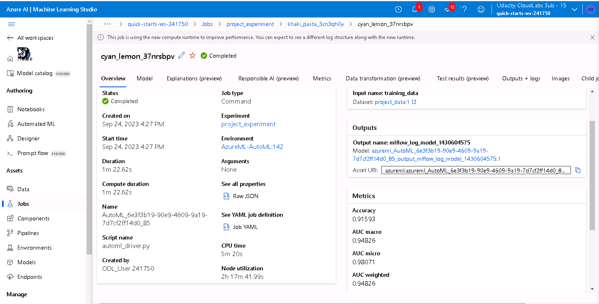
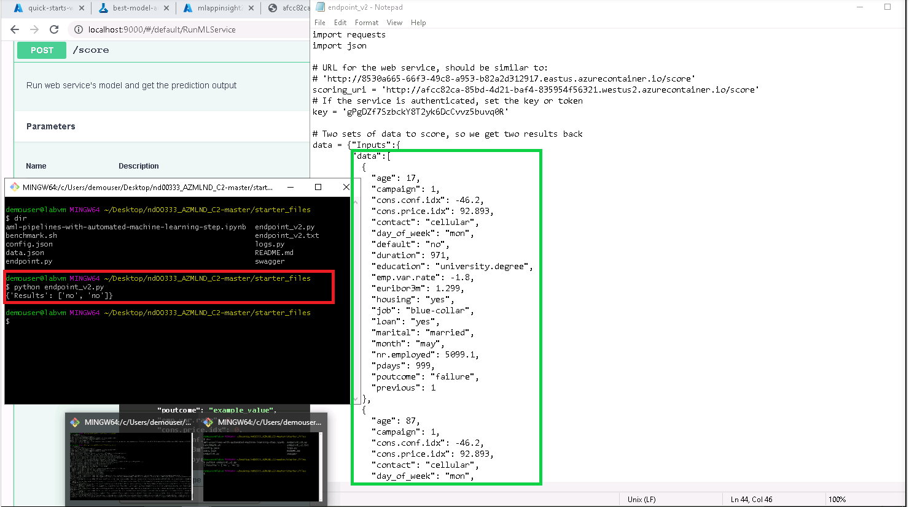
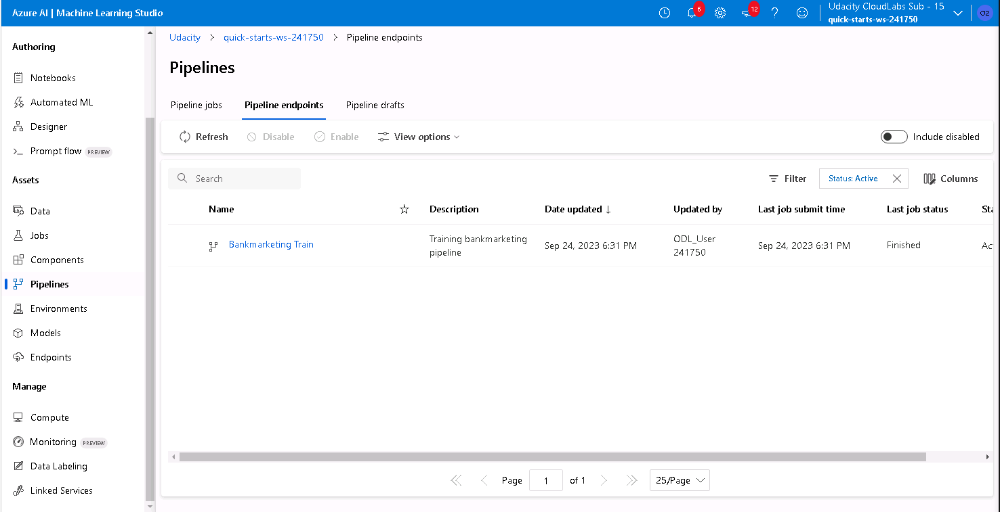

#  Project: Operationalizing Machine Learning

In this project we will perform a complete overview of the MLOps capabilities of AzureML tool, ranging from creating an AutoML experiment, publishing the best performing model through an endpoint, create a REST API documentation so as to know how to interact with the API, interact with the API, and finally encompass all this process in a pipeline that we can publish too.

## Architectural Diagram

In the next diagram, it is summarized the steps followed throughoyt this project.

The project could be divided in two differentiable parts:

 - The first one consisted of make use of the portal to register the data, create an AutoML experiment, publish the best model as an endpoint and consume it.
 - The second part, we make use of Python SDK to define a pipeline that consisted of two steps (read the data and execute AutoML model). Then we publish and consume this pipeline using Python SDK too.

## Key Steps
*TODO*: Write a short discription of the key steps. Remeber to include all the screencasts required to demonstrate key steps. 

### Step 1: Authentication

I was using the Udacity Lab environment, so I skipped this step since I was not authorized to create a service principal.

### Step 2: AutoML Experiment

In this step I created the AutoML experiment using the bank marketing dataset as input data. Then, a cluster was created so as to execute the models training process and finally we defined the Experiment as a classification task and defined the column `y` as the target variable.

#### Screenshot 2.1: Registered dataset
We registered the input data as `project_data`, since the original name was too long, and in this project we only use this that for the whole process and there won't be problems of missundestanding.

If we explore the content of the registered dataset we can see that the data is the same as the [Bankmarketing dataset](!https://automlsamplenotebookdata.blob.core.windows.net/automl-sample-notebook-data/bankmarketing_train.csv)

#### Screenshot 2.2: Create AutoML Experiment

#### Screenshot 2.3: AutoML Job Completed

#### Screenshot 2.4: Best Model

### Step 3: Best Model Deployment

The best model founded by the AutoML experiment has been deployed using AzureML Studio.

#### Screenshot 3: Best Model Endpoint

### Step 4: Enable Logging

Once the model is deployed, AppInsights was enabled so as to monitor the model execution by storing its logs.

#### Screenshot 4.1: AppInsights logs

### Step 5: Swagger Documentation

Swagger allows us to easily document the API REST methods so as to facilitate its use. To install swagger, I have run serve.py script in port 8000 and swagger.sh in port 9000. Then, interact with the swagger instance and retrieve its response from localhost.

#### Screenshot 5.1: Swagger

### Step 6: Consume Model Enpoints

Thanks to the provided script `endpoint.py`, I have been able to interact with the model REST API. It has been necessary to update the score_url and Key.

#### Screenshot 6.1: Output of model REST endpoint

In this screenshot we can see that we have provided the endpoint with two inpunt datasets (green square), and it has returned the predictions for both cases (red square).

#### Screenshot 6.2: Benchmark [Optional] 

 

 

### Step 7: Create, Publish and Consume Pipeline

The information required in the Jupyter Notebook was updated (registered dataset, cluster name, keys and model name), so as to create and publish the pipeline using the Python SDK.

#### Screenshot 7.1: Pipeline creation

 

#### Screenshot 7.2: Pipeline endpoint

#### Screenshot 7.3: REST endpoint and status of ACTIVE

 

#### Screenshot 7.4: Pipeline steps

#### Screenshot 7.5: Notebook summary pipeline submission

#### Screenshot 7.6: Scheduled runs

*NOTE:* I do not know why the outputs of the notebook  were not recorded when submitted to github. However both in the video and the screenshots you can verify that the whole notebook was executed in order to create and publish the pipeline endpoint.

#### Screenshot 7.8: Notebook execution

## Screen Recording

[Youtube_video](https://youtu.be/xIrkuYJ_aoI?feature=shared&t=37)

## Standout Suggestions

As we mentioned in the first submission of this course, the dataset is quite imbalance, which makes our models to be biased towards the 'no' answer. In order to better evaluate the models I would suggest to use another performance metric such as `f1-score` or `AUC`, instead of accuracy, since these metrics take into account the performance of the model in each class separately. We could also try to downsample the majority class or oversample the minority class, so as to achieve a balanced dataset.

Moreover, in the AutoML experiments all the data were provided and we do not really know what was the train/test strategy. We could also try to control this process dividing the data in 3 sets (Train, Validation and Test) and provide just two to the AutoML algorithm, setting the test set aside in order to evaluate model performance from our own, and choose the best model taking into account other metrics.

Finally, we could also try to train our own ML models, so as to compare its performance with the ones that we obtained from AutoML experiment.
